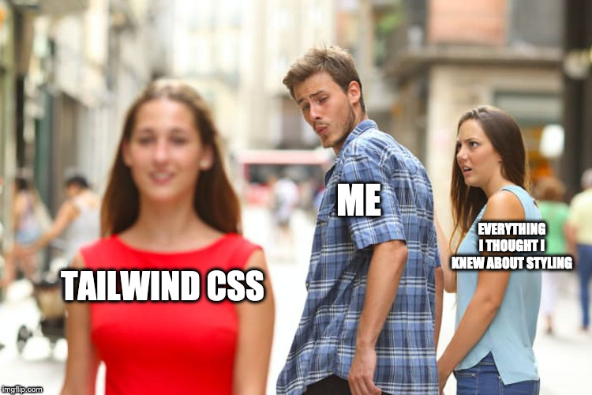
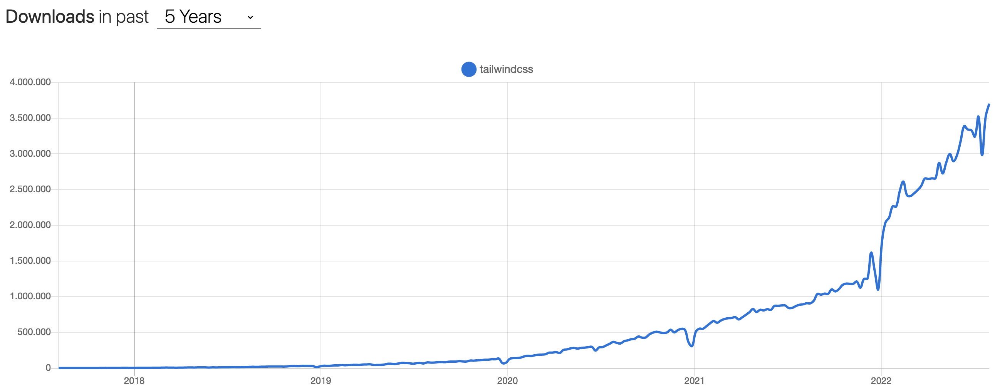

# Utility-first CSS frameworks

Moritz Stückler  
[Twitter (@MoStueck)](https://twitter.com/MoStueck) 
[Mastodon (@preya@mastodon.social)](https://mastodon.social/@preya) 
[GitHub (pReya)](https://github.com/pReya)

Note:

---
# HELLO 👋
### Who are you?

Note:
- Introductions (How much do you know about HTML/CSS/JS?)
- Repeat all names

---
<figure>

<figcaption>Source: <a href="https://twitter.com/vicvijayakumar/status/1204198443184463873">Twitter @vicvijayakumar</a></figcaption>
</figure>

Note:
- Understand this meme at the end of the lesson

---

## Why should we learn this?
<figure>

<figcaption>Source: <a href="https://npmtrends.com/tailwindcss">npmtrends.com/tailwindcss</a></figcaption>
</figure>

but also: It makes our life easier!

Note:
- Why should we learn about this?
  - Very popular in the last years
  - Typically makes styling easier and faster (higher productivity)

---

- "Utility first" concept
- How to TailwindCSS
- Exercises

Note:
- Understand this meme at the end of the lesson
